<a href="https://github.com/robert-lukowski">
  
</a>

<div align="center">
  <a href="https://github.com/robert-lukowski/cockroach-agentic-memory">
    
  </a>
</div>

<div align="center">
  
  
  
</div>

<br/>


<div align="center">
  <h2>About Me</h2>
</div>

```yaml
name:          Robert Lukowski
role:          Technical Engineer · Platform Engineering & Automation
focus:         AWS · Agentic AI · Infrastructure as Code · Enterprise Automation
building:      Secure cloud workflows that remove repetitive operational work
current_stack: Amazon Bedrock · Amazon Connect · Terraform · GitHub Actions · ServiceNow
inspiration:   Voyager 1 & 2 · engineering for the long journey
languages:     Polish · German · English · Spanish
location:      Wrocław, Poland
principle:     Automate repetition. Keep humans in control.
```

I build practical automation for real operational work: incident response, cloud platforms,
contact-center workflows and secure AI-assisted support. I focus on strong guardrails, clear
ownership and observable workflows that help people make better decisions.

<br/>


<div align="center">
  <h2>Featured Builds</h2>
  <sub>Production-minded experiments at the intersection of cloud, AI and IT operations</sub>
</div>

<br/>

<table>
  <tr>
    <td width="50%" valign="top">
      <h3>🧠 <a href="https://github.com/robert-lukowski/cockroach-agentic-memory">Agentic Incident Memory</a></h3>
      Operational memory for incident response. Retrieves how similar failures were actually resolved, removes configured direct identifiers before embedding, and generates evidence-grounded recommendations through Amazon Bedrock.
      <br/><br/>
      <sub><b>CockroachDB · Amazon Bedrock · AWS Lambda · MCP · Python · Streamlit</b></sub>
      <br/><br/>
      <a href="https://agentic-incident-command-center.streamlit.app"><b>Launch live demo →</b></a>
    </td>
    <td width="50%" valign="top">
      <h3>🟢 <a href="https://github.com/robert-lukowski/agentic-incident-memory-servicenow">ServiceNow Integration</a></h3>
      A scoped ServiceNow application that sends curated active-incident context to the protected analysis backend and writes the grounded recommendation back into Work Notes.
      <br/><br/>
      <sub><b>ServiceNow SDK · TypeScript · REST · AWS API Gateway · Secure properties</b></sub>
    </td>
  </tr>
  <tr>
    <td width="50%" valign="top">
      <h3>📡 <a href="https://github.com/robert-lukowski/hybrid-connectivity">Hybrid Connectivity Hub</a></h3>
      An autonomous edge communication node combining satellite packet reception with long-range LoRa mesh networking and automated telemetry pipelines.
      <br/><br/>
      <sub><b>Linux · TinyGS · Meshtastic · LoRa · Edge Computing · GitHub</b></sub>
    </td>
    <td width="50%" valign="top">
      <h3>⏱️ <a href="https://github.com/robert-lukowski/credential-expiry-reminder">Credential Expiry Reminder</a></h3>
      A GitHub Actions lab for monitoring credential and certificate expiration dates, opening deduplicated reminder issues and validating scheduled automation safely.
      <br/><br/>
      <sub><b>GitHub Actions · Scheduled workflows · Security automation</b></sub>
    </td>
  </tr>
</table>

<br/>


<div align="center">
  <h2>GitHub Certifications</h2>
  <sub>Six exams passed across administration, security, automation, AI and developer workflows</sub>
</div>

<br/>

<div align="center">
  
  
  
  <br/>
  
  
  
</div>

<br/>


<div align="center">
  <h2>Technology Stack</h2>
</div>

<table width="100%">
  <tr>
    <td align="center"><b>Cloud & Platform</b></td>
    <td align="center">
      
    </td>
  </tr>
  <tr>
    <td align="center"><b>Automation & Code</b></td>
    <td align="center">
      
    </td>
  </tr>
  <tr>
    <td align="center"><b>Data & Enterprise</b></td>
    <td align="center">
      
      &nbsp;
      
      
    </td>
  </tr>
</table>

<br/>


<div align="center">
  <h2>Contribution Activity</h2>
  
  <br/>
  
</div>

<br/>


<div align="center">
  <h3>Secure systems. Useful automation. Humans in control.</h3>
  <sub>Building beyond the demo.</sub>
</div>

<br/>

<div align="center">
  <a href="https://github.com/robert-lukowski">
    
  </a>
</div>
